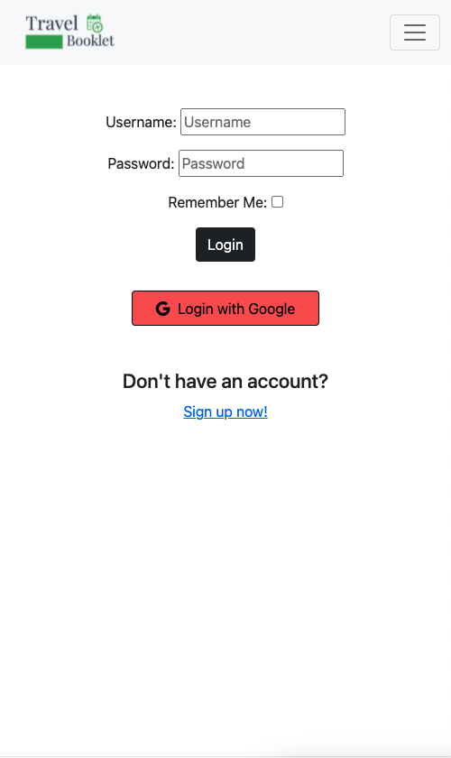
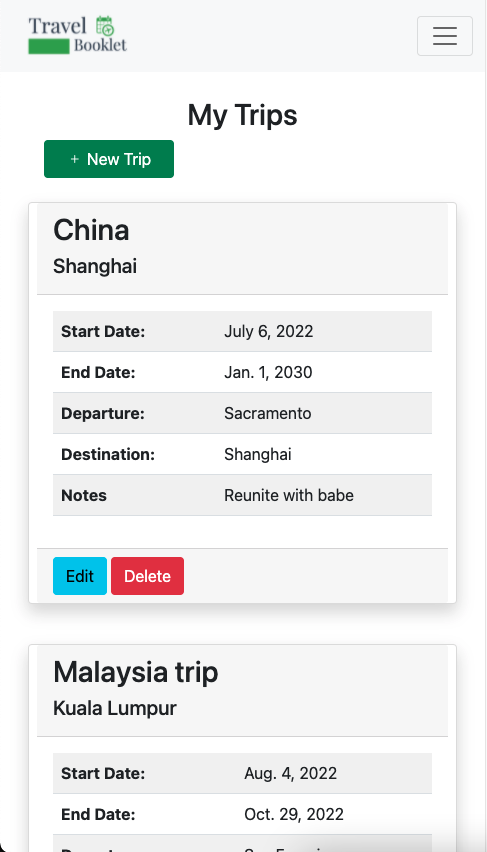
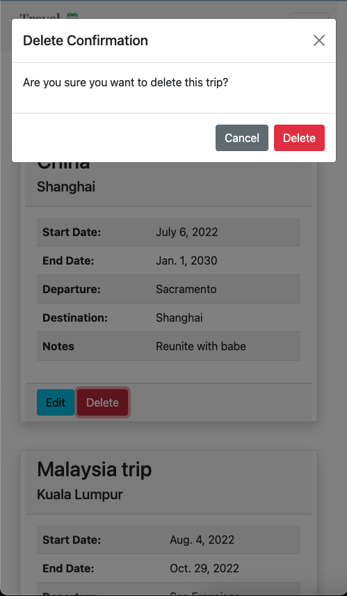
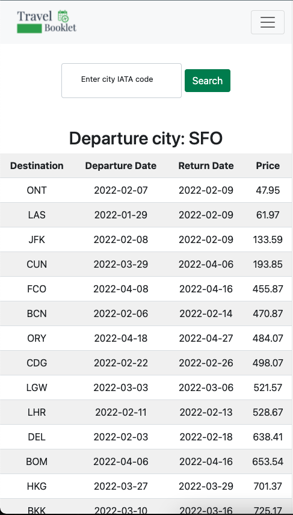

# Travel Booklet

| | | |
|:-------------------------:|:-------------------------:|:-------------------------:|
| |  |  
|   |  | 

 

## Description

Travel Booklet is the ultimate application for travel bugs. With multiple API's implemented, Travel Booklet is a full stack CRUD app that allows users to keep track and organize trips, search for cheapest flights from a departure city, and receive travel recommendations.
  

## Technologies Used

- HTML
- CSS
- JavaScript
- jQuery
- Bootstrap 5
- Python
- Django
- Django allauth
- Amadeus API
- Teleport API
  

## Getting Started

<a href="https://travelbooklet.herokuapp.com/" target="_blank" rel="noreferrernoopener">Click here to use my app!</a>

- On the home page, users can click the "Get Started" button to either login or go to their "Trips" page, depending if user is logged in. 
- In the "My Trips" page, users can create, edit, and delete trips. Trips are sorted by start date in a descending order.
- 

 

## Next Steps

- Sort flight search results by 
- Implement flight booking functionality.
- Implement hotel booking functionality.
- Create a profile page for users to view and update account information.
- Create folders to organize trips.
